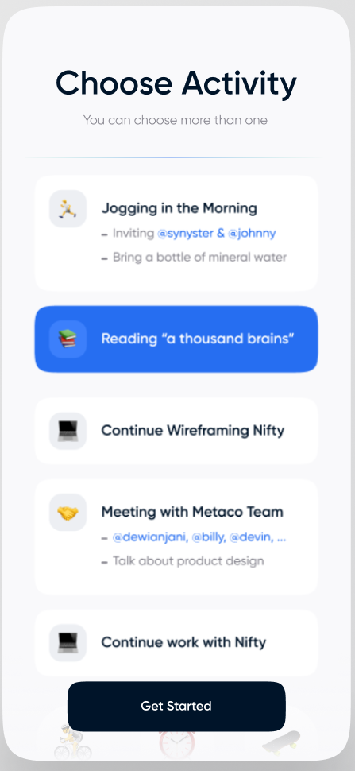

# NextJS Interview Project

Hello and welcome to App Snap Pop's interview project for NextJS! In this project you will demonstrate your abilities with this framework, and your compatibility with our team.

In this README, we'll define a set of tasks which you may complete however you like. This means you may use Google, ask me questions, install any package, and reuse code from other projects (just remember to put a comment reference external sources).

You are also allowed to delete and add new code as you see fit! After finishing the tasks, you'll be asked to open a peer review on GitHub.

This project should take one developer between 3 and 5 hours to complete.

## Tech Stack & Resources

1. Language: [Typescript](https://www.typescriptlang.org/)
2. Frontend: [NextJS](https://nextjs.org/docs/getting-started)
3. Backend: [NextJS](https://nextjs.org/docs/api-routes/introduction)
4. Schema Manager: [Prisma](https://www.prisma.io/)
5. DB: [Postgres](https://www.prisma.io/dataguide/postgresql/setting-up-a-local-postgresql-database)
6. Authentication: [Next Auth](https://next-auth.js.org/providers/credentials)
7. Style Library: [Tailwind](https://tailwindcss.com/)
8. Testing Library: [Jest](https://jestjs.io/)

## Overview

In this project you'll create a responsive, infinite scrolling list using the [Bored API](https://www.boredapi.com/). However, you only have a mobile design - you'll need to create a desktop design yourself.

The mobile design is:

## Infrastructure Test

1. Set up a local instance of Postgres for development,  [Reference](https://www.prisma.io/dataguide/postgresql/setting-up-a-local-postgresql-database)
2. Push the prisma models into your DB instance, [Reference](https://www.prisma.io/docs/reference/api-reference/command-reference)
3. Add a DB model for Bored API object [Reference](https://www.boredapi.com/documentation)

## Backend Test

1. Add username / password authentication using Next Auth [Reference](https://next-auth.js.org/providers/credentials)
2. Create an api endpoint in [/pages/api](./pages/api) which queries the bored api
3. If a model does not exist in the DB, then save it using the model created above.

## Frontend Test

1. Recreate the mobile design using tailwind. For the images you may use a random emoji.
2. Create a three column desktop layout.
3. Fill out card details using the Bored API using SSR.
4. Enable infinite scrolling using any library you like.

## Workflow Test

1. Run the linter and resolve all issues
2. Create a PR for this work
